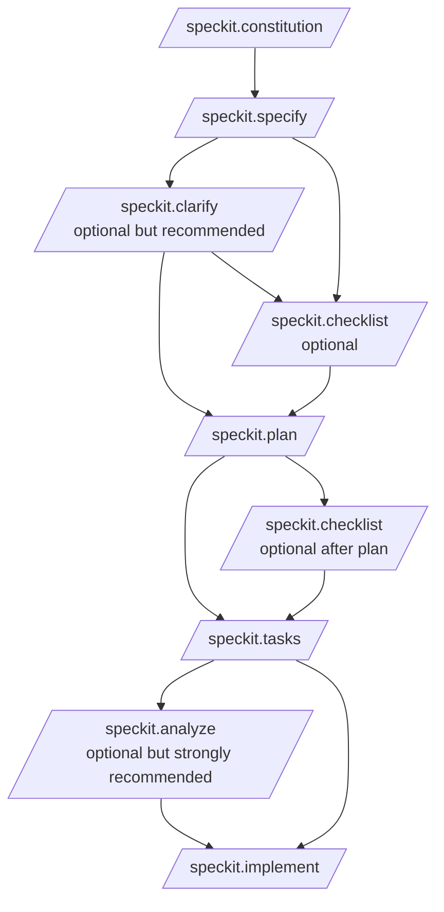

# Spec Kitコマンドガイド

このページは、GitHub Spec Kitのガイドの入口です。用途に応じて、次の2種類のドキュメントを使い分けてください。

- 初めて使う人向けの短縮版: [spec-kit_quickstart_guide.md](spec-kit_quickstart_guide.md)
- 実行順、入出力、前後関係まで確認したい人向けの詳細版: [spec-kit_command_reference.md](spec-kit_command_reference.md)
-  仕様書(SoT)と Spec Kit の仕様同期・成熟度ガイド: [spec-kit_docs_sync_guide.md](spec-kit_docs_sync_guide.md)
-  `specs/**` 履歴資産運用ガイド: [spec-kit_specs_docs_operation.md](spec-kit_specs_docs_operation.md)
- 調査ノート: [spec-kit_research.md](spec-kit_research.md)

## 最短で把握したい全体像



## まず覚えるべき実行順

```text
/speckit.constitution
/speckit.specify
/speckit.clarify
/speckit.plan
/speckit.tasks
/speckit.analyze
/speckit.implement
```

checklist は、spec 完成後か plan 完成後に挟む品質確認コマンドです。

## コマンドの役割を一言で言うと

- constitution: プロジェクト原則を決める
- specify: 何を作るかを定義する
- clarify: 仕様の曖昧さを減らす
- checklist: 要件の品質を点検する
- plan: どう作るかを技術計画に落とす
- tasks: 実装タスクへ分解する
- analyze: 仕様、計画、タスクの矛盾を検査する
- implement: 実装を進める

## どちらを読むべきか

### 短縮版を読むべき人

- Spec Kitを初めて触る
- とりあえず実行順と最低限の使い方を知りたい
- 典型的なプロンプト例だけ先に見たい

### 詳細版を読むべき人

- コマンドごとの入力、出力、前提条件を確認したい
- どの成果物が次のコマンドに渡るのか整理したい
- チーム運用やレビュー観点まで押さえたい
