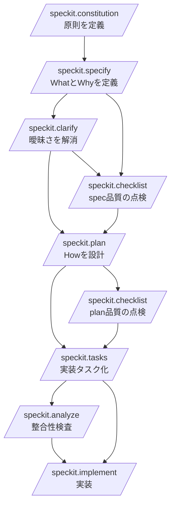
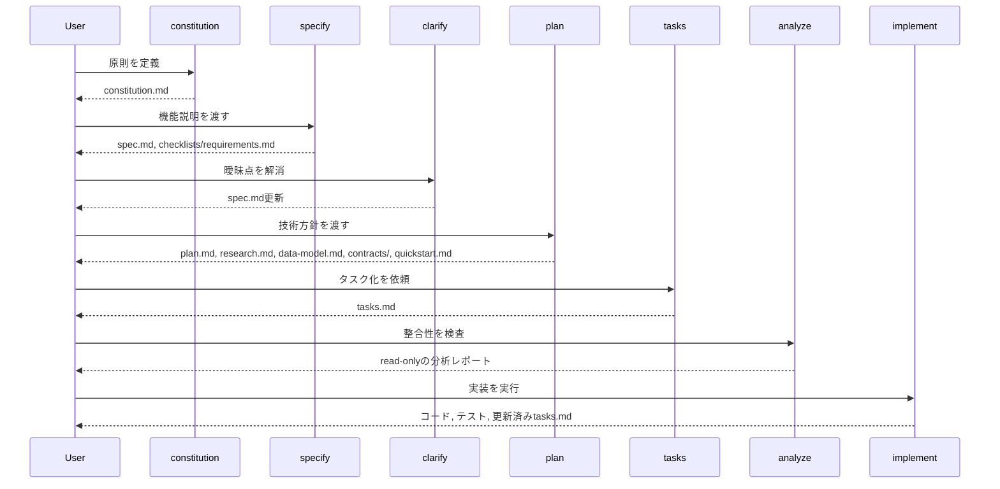
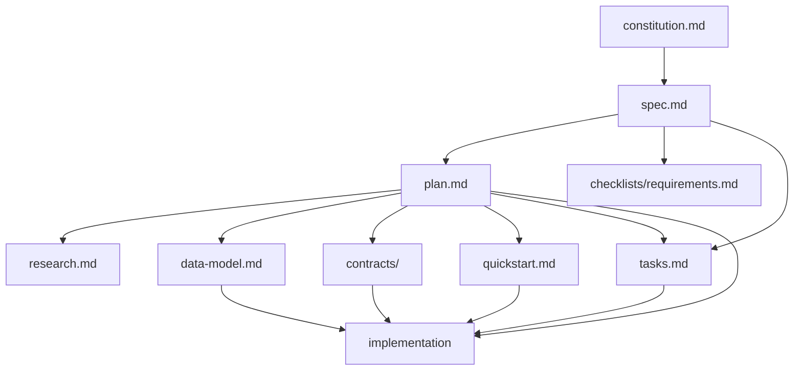

# Spec Kitコマンド詳細リファレンス

## このドキュメントの目的

このドキュメントは、GitHub Spec Kitの基本的な使い方を詳細に体系化したものです。特に以下を整理します。

- Spec Kitの基本フローと推奨されるコマンド実行順
- 各コマンドの目的、入力、出力、前後のコマンドとの関係
- 実行時の注意点と、次に進む判断基準
- 実際に使えるプロンプト例

本ドキュメントは、調査済みの以下のコマンドを対象にしています。

- /speckit.constitution
- /speckit.specify
- /speckit.clarify
- /speckit.checklist
- /speckit.plan
- /speckit.tasks
- /speckit.analyze
- /speckit.implement

## 全体像

Spec Kitは、仕様駆動開発を段階的に進めるためのコマンド群です。基本思想は、いきなり実装に入らず、まず仕様を固め、次に技術計画を作り、最後にタスク化してから実装することです。



推奨フローは次のとおりです。

```text
/speckit.constitution
  -> /speckit.specify
  -> /speckit.clarify          (任意、ただし推奨)
  -> /speckit.checklist        (任意、品質確認)
  -> /speckit.plan
  -> /speckit.checklist        (任意、plan後の品質確認)
  -> /speckit.tasks
  -> /speckit.analyze          (任意、ただし強く推奨)
  -> /speckit.implement
```

### コマンドの役割分担

- constitution: プロジェクト原則を定義する
- specify: 何を作るか、なぜ作るかを仕様として定義する
- clarify: 仕様の曖昧さを減らす
- checklist: 要件文書の品質を検証する
- plan: どう作るかを技術計画として定義する
- tasks: 実装タスクに分解する
- analyze: 仕様、計画、タスクの整合性を検査する
- implement: タスクに沿って実装を進める

## 標準的な実行順

### 1. /speckit.constitution

最初に実行して、プロジェクトの原則を決めます。コード品質、テスト方針、UX一貫性、パフォーマンス要件、セキュリティ方針などをここで定義します。

constitution は後続のコマンド、とくに /speckit.specify と /speckit.plan の判断基準になります。先に定義しておくと、生成される成果物の一貫性が上がります。

### 2. /speckit.specify

次に、自然言語でフィーチャー説明を与えて仕様書を作ります。ここでは What と Why を扱い、How は扱いません。

この段階では、技術スタックやフレームワーク名を書かないのが原則です。

### 3. /speckit.clarify

specify の直後、plan の前に実行します。仕様に曖昧さ、未解決事項、抜けがある場合に、その場で対話しながら spec.md を更新します。

省略は可能ですが、探索的スパイクでない限り実行したほうがよい位置づけです。

### 4. /speckit.checklist

spec.md や plan.md の品質を確認するためのチェックリストを生成します。これはコードのテストではなく、要件記述の品質テストです。

タイミングは主に2回あります。

- spec 完成後、plan 前
- plan 完成後、tasks 前

### 5. /speckit.plan

仕様を入力にして、技術計画を作ります。ここで初めて技術スタック、アーキテクチャ、データモデル、APIコントラクト、検証手順などの How を扱います。

### 6. /speckit.tasks

plan.md と spec.md をもとに、実装のための tasks.md を生成します。タスクはフェーズ分けされ、依存関係や並列実行可能性もここで整理されます。

### 7. /speckit.analyze

tasks 完了後、implement の前に実行します。spec.md、plan.md、tasks.md を横断して、整合性、カバレッジ、曖昧さ、constitution 違反などを検査します。

任意コマンドですが、実装前の最終品質ゲートとして使うのが推奨です。

### 8. /speckit.implement

最後に、tasks.md を実行計画として実装を進めます。テスト、コード、進捗更新、検証まで含めた実装フェーズです。

## ワークフロー全体図



  ## コマンドごとの生成ドキュメントの役割と読み方

  このセクションは、各コマンドが何を生成し、そのファイルをどう読めば次の意思決定につながるかをまとめたものです。

  ### /speckit.constitution が作るもの

  #### constitution.md の役割

  プロジェクト全体の判断基準です。設計方針、品質基準、テスト原則、セキュリティ原則などを固定し、後続コマンドの品質ゲートとして機能します。

  #### constitution.md の読み方

  - まず MUST に相当する強い原則を確認する
  - 次にテスト、性能、セキュリティ、UI一貫性などの非機能要求を確認する
  - specify や plan の内容がこの原則に反していないかを照合する

  #### 読むときの着眼点

  - 後続で迷いそうな設計判断が先にルール化されているか
  - 抽象論ではなく、レビューで判定可能な記述になっているか

  ### /speckit.specify が作るもの

  #### spec.md の役割

  フィーチャー仕様の中心文書です。ユーザー価値、ユーザーストーリー、機能要件、成功基準、スコープ境界を定義します。

  #### spec.md の読み方

  - 最初にフィーチャーの目的とユーザー像を読む
  - 次にユーザーストーリーを優先度順に確認する
  - その後、機能要件と成功基準がストーリーを支えているかを見る
  - 最後にスコープ外と前提条件を確認する

  #### 読むときの着眼点

  - What と Why に集中できているか
  - 実装方式が混ざっていないか
  - 各ユーザーストーリーが独立して価値を持つか
  - 成功基準が測定可能で技術非依存か

  #### checklists/requirements.md の役割

  spec.md の最低限の品質自己点検です。AIが仕様として未完成な点を残していないかを確認する初期チェックリストです。

  #### checklists/requirements.md の読み方

  - 未チェックの項目がないかを先に確認する
  - 未達があれば対応する spec.md の箇所に戻る
  - plan に進む前の出発判定として使う

  #### 読むときの着眼点

  - NEEDS CLARIFICATION が残っていないか
  - 曖昧、非測定、実装依存の記述が残っていないか

  ### /speckit.clarify が更新するもの

  #### 更新後の spec.md の役割

  clarify 後の spec.md は、単なる草案ではなく、plan に渡すための仕様確定版に近づいた文書です。Clarifications セクションは、なぜその仕様が確定したかの履歴としても使えます。

  #### 更新後の spec.md の読み方

  - Clarifications セクションを先に見て、何が追加で決まったか把握する
  - その後、該当する要件やユーザーストーリー本文に反映されているか確認する
  - plan で必要な前提が十分に埋まっているかを見る

  #### 読むときの着眼点

  - 重要な曖昧さが本当に解消されたか
  - Clarifications に書かれた内容が本文へ反映されているか
  - plan に必要な非機能要件や制約が不足していないか

  ### /speckit.checklist が作るもの

  #### checklists/*.md の役割

  UX、API、security、performance など、特定ドメインの要件品質を検査するためのチェックリストです。実装のテストではなく、要求の書き方そのものをレビューするために使います。

  #### checklists/*.md の読み方

  - まず対象ドメインが何かを確認する
  - 次に各チェック項目が、既存の spec.md や plan.md で満たされているかを確認する
  - 満たされない項目があれば、設計や実装に進む前に要求文書へ戻る

  #### 読むときの着眼点

  - 要求の抜け漏れが見つかるか
  - エラー系、境界条件、非機能要求がきちんと問われているか
  - 実装確認ではなく、要求の完全性と明確性を見ているか

  ### /speckit.plan が作るもの

  #### plan.md の役割

  spec.md を実装可能な技術計画へ変換する中核文書です。採用技術、構成、設計方針、フェーズ進行、constitution との整合をまとめます。

  #### plan.md の読み方

  - 最初に Summary と Technical Context を読む
  - 次に Constitution Check を見て、原則違反がないか確認する
  - その後、Project Structure と Phase 方針を確認する
  - 最後に補助成果物との関係を照合する

  #### 読むときの着眼点

  - spec の要求に対して技術選定が妥当か
  - NEEDS CLARIFICATION が残っていないか
  - テンプレート残骸や投機的な設計がないか

  #### research.md の役割

  技術選定の根拠を残す調査メモです。代替案、採用理由、制約、比較結果を保持します。

  #### research.md の読み方

  - どの技術候補を比較したか確認する
  - 採用理由が constitution や要求に整合しているかを見る
  - plan.md の技術選定と同じ結論になっているか照合する

  #### 読むときの着眼点

  - 理由のない技術選定になっていないか
  - ライセンス、保守性、運用性が抜けていないか

  #### data-model.md の役割

  エンティティ、属性、制約、関係を定義するデータ設計文書です。

  #### data-model.md の読み方

  - ユーザーストーリーに必要なエンティティが揃っているか確認する
  - 各属性、制約、関係が要件に対応しているかを見る
  - contracts や tasks に出てくる概念と名前が一致しているか照合する

  #### 読むときの着眼点

  - データの責務分割が自然か
  - 機密情報や監査項目が必要なら表現されているか

  #### contracts/ の役割

  APIやイベント境界の定義です。外部との入出力、インターフェース、エラー応答を明文化します。

  #### contracts/ の読み方

  - まずユースケースに必要なエンドポイントやイベントが揃っているか確認する
  - 次に入出力の型、必須項目、エラーケースを読む
  - data-model.md や quickstart.md と整合しているかを見る

  #### 読むときの着眼点

  - 正常系だけでなく失敗系も定義されているか
  - 認証、認可、バリデーションの扱いが抜けていないか

  #### quickstart.md の役割

  設計どおりに動作確認するための手順書です。実装後の検証観点も先に示します。

  #### quickstart.md の読み方

  - 手順を上から順に追って、何を検証できるか確認する
  - MVP に相当する検証が先に置かれているかを見る
  - 実装後にそのまま確認シナリオとして使えるか確認する

  #### 読むときの着眼点

  - 期待結果が具体的か
  - 前提条件やセットアップ手順が抜けていないか

  ### /speckit.tasks が作るもの

  #### tasks.md の役割

  仕様と設計を、実際に着手できる作業単位へ分解した実装計画です。誰が何をどの順で進めるかを定義します。

  #### tasks.md の読み方

  - Phase 1 と Phase 2 を見て、共通基盤の整備内容を確認する
  - 次に User Story ごとのフェーズを優先度順に読む
  - その後、Dependencies と Parallel Opportunities を確認する
  - 最後に MVP First や Implementation Strategy を確認する

  #### 読むときの着眼点

  - タスクが spec と plan を漏れなくカバーしているか
  - ファイルパスが具体的か
  - [P] が本当に並列実行可能か
  - 各ストーリーが独立テスト可能か

  ### /speckit.analyze が出すもの

  #### 分析レポートの役割

  spec.md、plan.md、tasks.md の整合性を実装前に点検する read-only レポートです。どこに矛盾、曖昧さ、カバレッジ不足があるかを可視化します。

  #### 分析レポートの読み方

  - まず CRITICAL と HIGH を優先して読む
  - 次に、どの成果物間のズレかを確認する
  - 修正先が spec、plan、tasks のどれかを切り分ける

  #### 読むときの着眼点

  - constitution 違反がないか
  - 要件に対応するタスクが抜けていないか
  - 同じ概念の用語ぶれが起きていないか

  ### /speckit.implement が作るもの

  #### 実装コードの役割

  spec、plan、tasks の内容を実際の動作するシステムへ変換した成果物です。

  #### 実装コードの読み方

  - tasks.md の順に対応実装を追う
  - contracts や data-model の内容がコードに反映されているか確認する
  - spec の成功基準を満たす振る舞いになっているかを見る

  #### テストコードの役割

  実装が要求どおりに動くかを確認する検証コードです。単体、統合、契約、E2E が含まれる場合があります。

  #### テストコードの読み方

  - どの要求やタスクに対応したテストかを確認する
  - 正常系だけでなく失敗系があるかを見る
  - quickstart と contracts の期待結果を検証しているか確認する

  #### 更新済み tasks.md の役割

  進捗記録です。どこまで完了し、どこが未着手かを示します。

  #### 更新済み tasks.md の読み方

  - [X] と未完了項目を見て実装状態を把握する
  - 完了済みタスクに対応するコードやテストが本当にあるか照合する
  - フェーズ途中で止まっている場合は、どのブロッカーで止まっているか判断する

## 各コマンドの詳細

### /speckit.constitution

#### 目的

プロジェクト全体で守るべき原則を定義します。以降のすべてのコマンドに対して、品質基準と設計方針を与える土台です。

#### 典型的な入力

- コード品質の原則
- テスト戦略
- UXやアクセシビリティの基準
- パフォーマンス目標
- セキュリティ方針

#### 引数の扱い

任意です。引数なしでも実行できますが、重視したい原則や改訂内容を自然言語で渡したほうが constitution の方向性が安定します。

#### 実際のプロンプト例

```text
/speckit.constitution
```

```text
/speckit.constitution コード品質、テスト、自動化、アクセシビリティ、パフォーマンス、セキュリティを重視するプロジェクト原則を定義してください
```

```text
/speckit.constitution テストファースト、API互換性維持、監査ログ、レスポンス性能、UI一貫性を必須原則として定義してください
```

```text
/speckit.constitution Library-First、CLI互換、TDD必須、観測性、SemVer遵守を非交渉原則として追加してください
```

#### 生成・更新されるもの

- constitution.md

#### 前後のコマンドとの関係

- 前: なし
- 後: /speckit.specify, /speckit.plan がこの内容を参照する

#### 実務上のポイント

- 曖昧なスローガンではなく、判断に使える原則を書く
- 後続のレビューでは constitution 違反が重大な問題になる

### /speckit.specify

#### 目的

フィーチャーの仕様を作るコマンドです。ユーザー価値、業務価値、ユースケース、機能要件、成功基準を spec.md にまとめます。

#### 基本構文

```text
/speckit.specify <自然言語によるフィーチャー説明>
```

#### 引数の扱い

必須です。自然言語の feature description を渡します。Who / What / Why / Out of Scope / Success Criteria に当たる内容を書くと安定します。

#### 実際のプロンプト例

```text
/speckit.specify Build an application that helps a small team manage projects, tasks, and comments. Users can move tasks between columns and track progress visually. Login is out of scope for this initial phase.
```

```text
/speckit.specify Develop a photo organization application. Users can create albums grouped by date, reorder albums by drag and drop, and preview photos in a tile layout. Nested albums are out of scope.
```

```text
/speckit.specify Create a customer support dashboard where agents can claim tickets, add internal notes, change ticket status, and escalate unresolved issues. Phone integration is out of scope.
```

```text
/speckit.specify Build an internal approval workflow for expense requests. Employees can submit requests, managers can approve or reject them, and finance can export approved items. Reimbursement payment itself is out of scope.
```

#### この段階で書くべきこと

- 何を実現したいか
- どのユーザーが使うか
- ユーザーが何をできる必要があるか
- どのような制約やスコープ境界があるか
- 成功をどう判断するか

#### この段階で書くべきではないこと

- 言語やフレームワーク
- API形式
- DB製品名
- 実装方式

#### 主な処理

- フィーチャー名から短いブランチ名を生成する
- 重複ブランチや重複ディレクトリを確認する
- spec.md を生成する
- checklists/requirements.md を生成して品質チェックする
- NEEDS CLARIFICATION を最大3件提示する

#### 生成されるもの

```text
specs/[###-feature-name]/
  spec.md
  checklists/
    requirements.md
```

#### 前後のコマンドとの関係

- 前: /speckit.constitution があると望ましい
- 後: /speckit.clarify または /speckit.plan

#### 次に進む判断基準

- spec.md に実装詳細が混ざっていない
- 成功基準が測定可能で技術非依存
- NEEDS CLARIFICATION が残っていないか、残っていても解消方針がある

### /speckit.clarify

#### 目的

spec.md の曖昧さや抜けを減らすための対話型コマンドです。plan に進む前に仕様の解像度を上げます。

#### 基本構文

```text
/speckit.clarify
/speckit.clarify Focus on security and performance requirements.
```

#### 引数の扱い

任意です。引数なしなら spec 全体の曖昧さを自動スキャンし、引数ありなら特定の曖昧さや重点論点を指定できます。

#### 実際のプロンプト例

```text
/speckit.clarify
```

```text
/speckit.clarify Focus on security and performance requirements.
```

```text
/speckit.clarify I want to clarify task card details, comment behavior, and project switching flow.
```

```text
/speckit.clarify Clarify data retention, audit logging, and failure notification behavior.
```

#### 主な処理

- spec.md を自動スキャンする
- 10カテゴリ程度の観点で不足を探す
- 最大5問までの対話で重要な不明点を詰める
- spec.md の Clarifications セクションと関連箇所を更新する

#### 生成・更新されるもの

- spec.md の更新

#### 前後のコマンドとの関係

- 前: /speckit.specify
- 後: /speckit.plan

#### 実行すべきタイミング

- specify の直後
- plan の前
- 仕様に曖昧さ、矛盾、未決事項があるとき

#### スキップできるケース

- スパイクや探索的プロトタイプ
- 後で手戻りが発生しても構わない短期検証

#### 実務上のポイント

- 原則として plan 前に終わらせる
- 技術選定の質問はここでは最小限にする
- 一度で足りなければ複数回実行する

### /speckit.checklist

#### 目的

要件記述の品質を検証するチェックリストを作成します。実装の正しさではなく、要求が明確で完全かどうかを確認するためのものです。

#### 基本構文

```text
/speckit.checklist
/speckit.checklist Focus on UX requirements quality
/speckit.checklist Create a checklist for the following domain: security
```

#### 引数の扱い

任意です。引数なしなら汎用的な checklist を作り、引数ありなら対象ドメイン、深さ、must-have 観点を指定できます。

#### 実際のプロンプト例

```text
/speckit.checklist
```

```text
/speckit.checklist Focus on UX requirements quality
```

```text
/speckit.checklist Security checklist. Must include authentication requirements, data protection, and breach response requirements.
```

```text
/speckit.checklist API contracts completeness and consistency
```

#### 主な処理

- spec.md、plan.md、tasks.md を必要に応じて読む
- ドメイン別の観点を整理する
- チェックリストファイルを生成する

#### 生成されるもの

- checklists/ux.md
- checklists/api.md
- checklists/security.md
- checklists/performance.md
- その他、指定したドメインのチェックリスト

#### 前後のコマンドとの関係

- 前1: /speckit.specify または /speckit.clarify の後
- 前2: /speckit.plan の後
- 後: 仕様や計画の修正、または /speckit.tasks

#### 実行タイミング

- spec 完成後に一度
- plan 完成後に必要なドメインで再度
- 仕様や計画を更新したら再実行してよい

#### 実務上のポイント

- これは requirements writing の unit tests という位置づけ
- 動作確認やAPIレスポンス検証のような実装テストとは別物
- フォーカスドメインを明示すると質問が減り、結果が安定しやすい

### /speckit.plan

#### 目的

spec.md を受けて、技術的な実装計画を作成します。How を扱うフェーズです。

#### 基本構文

```text
/speckit.plan [技術スタック・アーキテクチャ上の指示]
```

#### 引数の扱い

任意です。技術スタック、制約、アーキテクチャ方針を自然言語で追加できます。引数なしでも実行できますが、情報が多いほど `plan.md` は安定します。

#### 実際のプロンプト例

```text
/speckit.plan Use FastAPI for backend services, PostgreSQL for storage, and React for the frontend. Prioritize simple deployment and a small number of dependencies.
```

```text
/speckit.plan The application uses Vite with minimal libraries. Use vanilla HTML, CSS, and JavaScript as much as possible. Metadata is stored in a local SQLite database.
```

```text
/speckit.plan WebSocket for real-time messaging, PostgreSQL for history, Redis for presence.
```

```text
/speckit.plan Use Next.js for the web app, Supabase for authentication and storage, and background jobs for asynchronous notifications. Optimize for low operational overhead.
```

#### この段階で書くこと

- 言語、フレームワーク、主要ライブラリ
- データストレージ
- システム構成
- APIスタイル
- テスト方針
- パフォーマンス目標や制約

#### 主な処理

- spec.md と constitution.md を読み込む
- Technical Context を埋める
- Constitution Check を行う
- research.md を作る
- data-model.md を作る
- contracts/ を作る
- quickstart.md を作る
- Phase 1 設計後に再度 constitution 整合を確認する

#### 生成されるもの

```text
specs/[###-feature-name]/
  plan.md
  research.md
  data-model.md
  quickstart.md
  contracts/
```

#### 前後のコマンドとの関係

- 前: /speckit.specify、必要に応じて /speckit.clarify
- 後: /speckit.tasks、必要に応じて /speckit.checklist

#### 次に進む判断基準

- Constitution Check が通っている
- NEEDS CLARIFICATION が残っていない
- Project Structure のテンプレート残骸が消えている
- research、data model、contracts、quickstart の間に矛盾がない

#### 実務上のポイント

- spec.md の繰り返しではなく、技術意思決定を書く
- 先回りの投機的な設計を増やしすぎない
- エラーケースや制約も plan に含める

### /speckit.tasks

#### 目的

plan.md と spec.md を、実装可能なタスク一覧に分解します。AIや開発者がそのまま実装できる粒度の tasks.md を作るフェーズです。

#### 基本構文

```text
/speckit.tasks
/speckit.tasks Please include test tasks using TDD approach.
/speckit.tasks We have 3 developers. Please maximize parallel task opportunities.
```

#### 引数の扱い

任意です。引数なしなら標準的なタスク分解、引数ありなら TDD、MVP 範囲、並列化、story の絞り込みなどを指定できます。

#### 実際のプロンプト例

```text
/speckit.tasks
```

```text
/speckit.tasks Please include test tasks using TDD approach. Write tests first before implementation.
```

```text
/speckit.tasks Focus on User Story 1 only for the MVP. Skip User Stories 2 and 3 for now.
```

```text
/speckit.tasks We have 3 developers. Please maximize parallel task opportunities.
```

```text
/speckit.tasks Generate tasks that keep the API contract work separate from the UI work.
```

#### 入力として重視されるもの

- spec.md
- plan.md
- data-model.md
- contracts/
- quickstart.md
- research.md

#### 主な処理

- Setup フェーズを作る
- Foundational フェーズを作る
- User Storyごとのフェーズを P1、P2、P3 順で作る
- Polish フェーズを作る
- 依存関係を整理する
- 並列実行可能なタスクに [P] を付ける

#### 生成されるもの

- tasks.md

#### tasks.md の典型構造

```text
Phase 1: Setup
Phase 2: Foundational
Phase 3: User Story 1 (P1)
Phase 4: User Story 2 (P2)
Phase 5: User Story 3 (P3)
Phase N: Polish & Cross-Cutting Concerns
Dependencies & Execution Order
Parallel Opportunities
Implementation Strategy
```

#### 前後のコマンドとの関係

- 前: /speckit.plan
- 後: /speckit.analyze または /speckit.implement

#### 次に進む判断基準

- plan.md と spec.md の内容が全タスクに反映されている
- Phase 2 の共通基盤が十分に定義されている
- ファイルパスが具体的である
- [P] の付け方が妥当である
- ユーザーストーリーごとの独立テスト基準が書かれている

#### 実務上のポイント

- サンプルタスクやプレースホルダーを残さない
- 曖昧な作業名ではなく、ファイル単位まで具体化する
- TDDをしたい場合は引数で明示する

### /speckit.analyze

#### 目的

spec.md、plan.md、tasks.md の3つを横断的に読み、矛盾、曖昧さ、重複、カバレッジ不足、constitution 違反を検出します。

#### 基本構文

```text
/speckit.analyze
/speckit.analyze Focus on security and performance requirements.
```

#### 引数の扱い

任意です。引数なしなら全体監査、引数ありなら security / performance / terminology / task coverage など重点観点を指定できます。

#### 実際のプロンプト例

```text
/speckit.analyze
```

```text
/speckit.analyze Focus on security and performance requirements.
```

```text
/speckit.analyze Check if all non-functional requirements have corresponding tasks.
```

```text
/speckit.analyze Review terminology drift between spec, plan, and tasks.
```

#### 特徴

- 完全に read-only
- ファイルを自動修正しない
- 実装前の最終チェックとして使う

#### 主な検出カテゴリ

- duplication
- ambiguity
- underspecification
- constitution alignment
- coverage gaps
- inconsistency

#### 深刻度

- CRITICAL
- HIGH
- MEDIUM
- LOW

#### 前後のコマンドとの関係

- 前: /speckit.tasks 完了後
- 後: 問題修正、または /speckit.implement

#### 実行タイミング

- 最も早く実行できるのは tasks.md 作成直後
- 最も遅くて implement の直前

#### 次に進む判断基準

- CRITICAL 問題がない
- HIGH 問題について対応方針がある
- タスクが全要件をカバーしている

#### 実務上のポイント

- 任意だが、実質的には実装前の品質ゲートとして使うべき
- 修正を提案してもらうことはできるが、自動適用はしない

### /speckit.implement

#### 目的

tasks.md を順に処理し、実装、テスト、設定ファイル整備、進捗更新まで進めるコマンドです。

#### 基本構文

```text
/speckit.implement
/speckit.implement Only execute Phase 1 tasks and stop.
/speckit.implement MVP mode: Only implement User Story 1.
/speckit.implement Run all [P] tasks in Phase 2 in parallel before proceeding.
```

#### 引数の扱い

任意です。引数なしなら tasks 全体を進め、引数ありなら実装範囲、停止条件、並列実行対象、MVP 制約を指定できます。

#### 実際のプロンプト例

```text
/speckit.implement
```

```text
/speckit.implement Only execute Phase 1 tasks and stop.
```

```text
/speckit.implement MVP mode: Only implement User Story 1. Stop after validation.
```

```text
/speckit.implement Run all [P] tasks in Phase 2 in parallel before proceeding to Phase 3.
```

```text
/speckit.implement Implement only the API and test tasks first. Leave the frontend tasks unchecked.
```

#### 主な処理

- checklists の完了状態を確認する
- tasks.md、plan.md を読み込む
- data-model.md、contracts/、research.md、quickstart.md を参照する
- 必要な ignore ファイルを生成または検証する
- タスク順に実装する
- tests before code の原則で進める
- 完了タスクを tasks.md 上で [X] に更新する
- 最終検証を行う

#### 入力として必要なもの

- tasks.md
- plan.md
- spec.md
- constitution.md

#### 生成・更新されるもの

- 実装コード
- テストコード
- 設定ファイルや ignore ファイル
- 更新済み tasks.md

#### 前後のコマンドとの関係

- 前: /speckit.tasks、できれば /speckit.analyze
- 後: 実装結果のレビュー、追加修正

#### 次に進む判断基準

- checklists が完了している
- tasks.md が十分に具体的である
- plan.md と contracts の内容が実装判断に足る

#### 実務上のポイント

- [P] は tasks.md の設計に基づく。並列実行したければ tasks 側で設計しておく必要がある
- Phase 2 が終わる前に User Story フェーズへ進めない構造になっている
- テスト先行の順序が守られているかをレビューで確認する

## 主要成果物の関係



```text
constitution.md
  基準と原則

spec.md
  何を作るか

checklists/requirements.md
  spec.md の品質自己点検

plan.md
  どう作るか

research.md
  技術判断の根拠

data-model.md
  データ設計

contracts/
  APIやイベントの境界定義

quickstart.md
  検証手順

tasks.md
  実装の作業単位
```

関係は次のように整理できます。

- constitution.md はすべての判断基準になる
- spec.md は plan.md の入力になる
- plan.md は tasks.md の入力になる
- research.md、data-model.md、contracts/、quickstart.md は plan を補強する設計成果物であり、tasks と implement の補助入力でもある
- analyze は spec、plan、tasks の3者関係を点検する
- implement は上記成果物をまとめて実装に変換する

## どのコマンドをどこで使うべきか

### 仕様を固める段階

- /speckit.constitution
- /speckit.specify
- /speckit.clarify
- /speckit.checklist

### 技術設計を固める段階

- /speckit.plan
- /speckit.checklist

### 実装準備を固める段階

- /speckit.tasks
- /speckit.analyze

### 実装する段階

- /speckit.implement

## 実践的な最小フロー

最小でも、次の流れは守ったほうがよいです。

```text
/speckit.constitution
/speckit.specify [機能説明]
/speckit.clarify
/speckit.plan [技術方針]
/speckit.tasks
/speckit.analyze
/speckit.implement
```

checklist は任意ですが、要求品質を上げたいなら spec 後か plan 後の少なくとも一度は挟む価値があります。

## 省略してもよいコマンドと、省略しにくいコマンド

### 省略しにくいもの

- /speckit.specify
- /speckit.plan
- /speckit.tasks
- /speckit.implement

これらは中核フローです。

### 状況によって省略可能なもの

- /speckit.constitution
- /speckit.clarify
- /speckit.checklist
- /speckit.analyze

ただし、実運用では省略可能であっても、品質・手戻り削減の観点では重要です。

## 結論

Spec Kitは、単なるコマンド群ではなく、仕様、設計、タスク、実装を順番に接続するワークフローです。中核となる順序は次の通りです。

```text
constitution -> specify -> clarify -> plan -> tasks -> analyze -> implement
```

checklist はこのフローの途中で品質を点検する補助コマンドです。

要点を一言でまとめると、specify で What を固め、clarify で曖昧さを消し、plan で How を決め、tasks で作業に落とし、analyze で齟齬を潰し、implement で実装する、という流れです。
