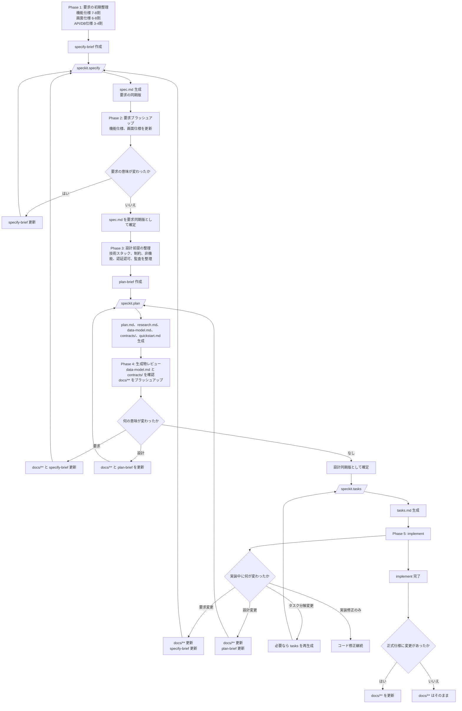
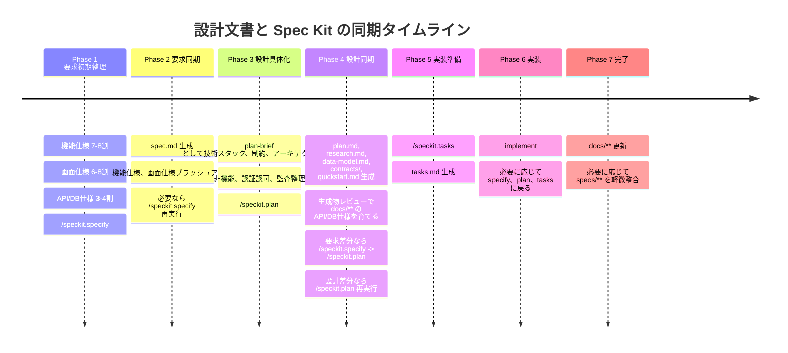

# 仕様書(SoT)の同期・成熟度ガイド

この文書は、**仕様書(SoT)、`/speckit.specify` と `/speckit.plan` の関係、時間軸に応じた仕様書の深さ** を一つの流れとして整理したガイドである。

主な対象は、機能仕様・画面仕様・API仕様・DB仕様を、人と AI の対話で並行して育てながら Spec Kit と同期していく運用である。

次のことを前提に読み替えて、この文書を読んて欲しい。
- `docs/**`: Spec Kitに入力する人が作成 / メンテナンスする仕様書(SoT)
- `*-brief`: Spec Kitに入力する際の入力情報を取りまとめた文書(引数相当)

## 1. 先に結論

最重要な結論は次の 7 点である。

1. **機能仕様・画面仕様・API仕様・DB仕様は、実務では並行して育つ**
2. **ただし、各フェーズで正として扱う深さは制御する**
3. **詳細さと拘束力は分けて扱う**
4. **`docs/**` が長期保守の仕様書(SoT)である**
5. **`spec.md` と `plan.md` は、その時点の同期済みスナップショットである**
6. **`/speckit.specify` は要求同期、`/speckit.plan` は設計同期の工程である**
7. **要求の意味が変われば `specify`、設計の意味が変われば `plan` に戻る**

## 2. 仕様書(SoT) と成果物の役割分担

仕様書(SoT)は一枚岩ではなく、**長期保守の正本** と **フェーズ推進の同期版** に分けて考えると整理しやすい。

| 層 | 主な置き場 | 役割 |
| --- | --- | --- |
| 長期保守の仕様書(SoT) | `docs/**` | 正式仕様として継続更新する主文書 |
| 要求同期の入力 | `specify-brief` | `specify` に渡す要求整理の入力 |
| 要求同期の出力 | `specs/**/spec.md` | その時点の要求を束ねた同期済みスナップショット |
| 設計同期の補助入力 | `plan-brief` | `plan` に渡す技術スタック、制約、アーキテクチャ方針の整理の入力 |
| 設計同期の出力 | `specs/**/plan.md` | その時点の設計を束ねた同期済みスナップショット |
| 実装準備の出力 | `specs/**/tasks.md` | 実装へ接続するタスク分解結果 |

ここでいう `specify-brief` / `plan-brief` は運用上の整理名であり、Spec Kit 標準コマンドが特定ファイル名を必須入力として要求することを意味しない。

この整理では、`docs/**` と `spec.md` / `plan.md` は競合しない。前者は**長期保守の正本**、後者は**その時点の同期版**として役割分担する。

## 3. 基本原則

### 3.1 仕様書は並行して育てる

機能仕様、画面仕様、API仕様、DB仕様は、完全に直列で固めるものではない。実務では相互に影響しながら少しずつ具体化する。

### 3.2 詳細さと拘束力は分ける

API仕様や DB仕様は、必要なら `specify` 前から概略を書いてよい。ただし Spec Kit 標準フローでは、これらを `plan` 前に詳細化しておくことは必須ではなく、`/speckit.plan` の生成物から具体化していく進め方でもよい。どちらの進め方でも、**要求に従属するドラフト**として扱い、業務判断より先に設計が確定しないようにする。

| 観点 | 意味 |
| --- | --- |
| 深さ | どれだけ詳しく書かれているか |
| 拘束力 | その内容をどこまで確定事項として扱うか |

### 3.3 逆流はレビューで検出して前段へ戻す

問題なのは API / DB を早く書くことではない。問題なのは、**未確定要求が API / DB の詳細によって固定される逆流**である。

実務では、`/speckit.plan` が生成した `data-model.md` や `contracts/` をレビューし、その内容が要求を縛りすぎていないかを確認する。もし生成結果から要求不足や逆流が見つかったら、仕様書をブラッシュアップし、**要求の意味が変わるなら `specify -> plan` を流し直す**。設計の意味だけが変わるなら `plan` を流し直す。

### 3.4 Spec Kit は一発生成ではなく同期ポイント

- `/speckit.specify` は要求系仕様を同期し、`spec.md` に落とす
- `/speckit.plan` は `spec.md` と constitution を前提に、`plan.md`、`research.md`、`data-model.md`、`contracts/`、`quickstart.md` を生成する

Spec Kit は、仕様をゼロから魔法のように作る道具ではなく、**人と AI が育てた仕様群をフェーズごとに整流する仕組み**として扱う。

### 3.5 仕様書は `specify` と `plan` の往復で育てる

標準的な流れでは、まず `specify` の結果を見て要求仕様を育て、その次に `plan` の結果を見て設計仕様を育てる。この往復を繰り返し、要求の意味が固まってから設計を深め、設計レビューの結果が要求に波及したら再び `specify` へ戻る。

## 4. 時間軸に応じた仕様書の深さ

### 4.1 フェーズ全体像

| フェーズ | 機能仕様 | 画面仕様 | API仕様 | DB仕様 | Spec Kit の扱い |
| --- | --- | --- | --- | --- | --- |
| `specify` 前 | 7〜8 割程度まで具体化 | 6〜8 割程度まで具体化 | 3〜4 割程度の概略ドラフト | 3〜4 割程度の概略ドラフト | `specify-brief` を準備 |
| `specify` 後 | `spec.md` を見て要求をブラッシュアップ | 同左 | 概略制約を維持 | 概略構造を維持 | 必要なら `specify` 再実行 |
| `plan` 前 | ほぼ確定 | ほぼ確定 | 概略制約を維持 | 概略構造を維持 | `spec.md` と constitution、`plan-brief` で `plan` 実行 |
| `plan` 後 | 必要なら最終整合 | 必要なら最終整合 | `contracts/` をレビューし、`docs/**` の API仕様を育てる | `data-model.md` をレビューし、`docs/**` の DB仕様を育てる | 要求差分なら `specify -> plan`、設計差分なら `plan` を再実行 |
| implement 前 | 正式仕様 | 正式仕様 | 正式契約 | 正式構造 | `tasks` と実装へ接続 |

注記: この表は `docs/**` 側の成熟度目安であり、Spec Kit 標準コマンドの必須入力をそのまま表したものではない。特に `/speckit.plan` は、詳細 API / DB 仕様を事前入力として要求するというより、`spec.md` と `plan-brief` 相当の技術方針から `data-model.md` や `contracts/` を生成する工程として理解するのが正確である。したがって API / DB 仕様書は、`plan` の生成物レビューを通じて育て、必要なら `specify -> plan` を流し直す理解がより実態に近い。

### 4.2 フェーズ別の読み方

#### `specify` 前

- 機能仕様は要求の主文書としてかなり具体化する
- 画面仕様は主要画面、操作、遷移が誤解なく伝わる程度まで書く
- API仕様と DB仕様は、要求に効く制約が見える程度のドラフトに留める

#### `plan` 前

- 機能仕様と画面仕様は、ほぼ確定した要求として扱える深さへ上げる
- `plan` に必要なのは、技術スタック、制約、アーキテクチャ方針、既知の外部 I/F・データ条件などをまとめた `plan-brief` 相当の設計前提である
- API仕様は概略制約を維持し、DB仕様は概略構造を維持したままでよい
- Spec Kit 標準では、詳細 API / DB 仕様を `plan` 前に 7〜8 割まで確定しておく必要はない
- API / DB の本格的なブラッシュアップは、まず `plan` の生成物を見てから行うのが自然である
- 非機能、認証認可、監査などの横断条件は、この段階で整理しておくと `plan` が安定する

#### `plan` 後

- `plan.md`、`research.md`、`data-model.md`、`contracts/`、`quickstart.md` をレビューする
- それらを起点に `docs/**` 側の API / DB / 横断設計をブラッシュアップする
- レビュー結果が要求の意味に波及するなら、`specify` に戻ってから `plan` まで流し直す
- レビュー結果が設計の意味だけに留まるなら、`plan` を流し直す

#### implement 前

- 全仕様書を、実装・レビュー・保守に耐える正式仕様へ引き上げる
- API仕様は正式契約、DB仕様は正式構造として扱える状態にする

## 5. 文書種別ごとの最低到達点

この節では、各文書が各フェーズで最低限どの深さに達しているべきかをまとめる。

ただし、ここでの API / DB 項目は **`docs/**` 側に正式仕様を持たせる運用を採る場合の成熟度目安** であり、Spec Kit 標準フローで `/speckit.plan` の入力として必須になる項目一覧ではない。`/speckit.plan` 自体は `spec.md` と技術方針から `data-model.md` と `contracts/` を生成できる。

### 5.1 機能仕様

#### `specify` 前

- 背景
- 目的
- 対象ユーザー
- 主要ユースケース
- 必須機能
- 業務ルール
- 受け入れ条件
- 対象外

#### `plan` 前

- 権限差分が明確
- 状態遷移ルールが明確
- 条件分岐が明確
- 受け入れ条件が実装観点で確認可能

#### implement 前

- 正式な要求としてレビュー可能
- スコープ内外が明確
- 業務ルールの曖昧さが解消済み
- 受け入れ条件がテスト観点へ落ちる

### 5.2 画面仕様

#### `specify` 前

- 画面一覧
- 各画面の目的
- 主な表示項目
- 主な入力項目
- 主な操作
- 主要遷移

#### `plan` 前

- 表示項目がほぼ確定
- 入力項目がほぼ確定
- バリデーション観点
- 権限による表示、操作差分
- 一覧、詳細、編集導線
- 主要メッセージ方針

#### implement 前

- 実装、レビュー可能な粒度
- 遷移と操作条件が明確
- 表示条件が明確
- 主要エラーパターンが明確

### 5.3 API仕様

#### `specify` 前

- 想定 API 一覧
- 主な用途
- 要求に影響する制約
- 認可観点の概要
- 検索、ページング、更新の必要有無

この段階では、**要求従属のドラフト**として扱う。

#### `plan` 前（先行整理する場合）

- エンドポイント
- メソッド
- リクエスト形式
- レスポンス形式
- エラー形式
- 認可条件
- ページング、ソート、検索条件
- 更新時制約

#### `plan` 後（標準フローの叩き台）

- `contracts/` の生成結果を確認する
- API契約の叩き台を得る
- `docs/**` 側の API仕様へ反映して育てる
- 要求差分なら `specify -> plan`、設計差分なら `plan` を再実行する

#### implement 前

- 契約テスト可能な粒度
- フロント、バック分業可能な粒度
- 主要エラー定義が明確
- 認可、競合、異常系が明確

### 5.4 DB仕様

#### `specify` 前

- 主エンティティ
- 主な関係
- 履歴の必要有無
- 一意制約の必要有無
- 論理削除、物理削除の必要有無
- 監査ログの必要有無

この段階では、**業務構造の概略**として扱う。

#### `plan` 前（先行整理する場合）

- 主テーブル
- 主カラム
- 主キー
- 外部キー
- 一意制約
- リレーション
- 履歴保持方針
- 論理削除、物理削除方針
- 監査方針

#### `plan` 後（標準フローの叩き台）

- `data-model.md` の生成結果を確認する
- データ構造の叩き台を得る
- `docs/**` 側の DB仕様へ反映して育てる
- 要求差分なら `specify -> plan`、設計差分なら `plan` を再実行する

#### implement 前

- 実装可能な粒度
- migration に落とせる粒度
- レビュー可能な制約定義
- データ整合性条件が明確

## 6. `specify` と `plan` の関係

`specify` と `plan` は、前後関係だけでなく、**同期対象が違う**工程として理解すると迷いにくい。

| 工程 | 主対象 | 入力の中心 | 出力 | 役割 |
| --- | --- | --- | --- | --- |
| `/speckit.specify` | 要求 | 機能仕様、画面仕様、要求に効く API / DB の概略 | `spec.md` | 要求を同期して束ねる |
| `/speckit.plan` | 設計 | `spec.md`、constitution.md、`plan-brief` に整理した技術スタック・制約・アーキテクチャ方針 | `plan.md`、`research.md`、`data-model.md`、`contracts/`、`quickstart.md` | 技術設計成果物を生成して束ねる |

標準フローでは、API / DB 仕様書を `plan` 前に固定してから進むというより、`plan` の生成物をレビューしながら仕様書を育てる理解の方が実態に近い。

整理すると、次の順序になる。

1. `docs/**` で要求を育てる
2. `specify-brief` を作る
3. `/speckit.specify` で `spec.md` を得る
4. `spec.md` を見て `docs/**` 側の要求仕様をブラッシュアップする
5. `plan-brief` として技術方針や制約を整理する
6. `/speckit.plan` で `plan.md`、`research.md`、`data-model.md`、`contracts/`、`quickstart.md` を得る
7. 生成物をレビューし、`docs/**` 側の設計仕様をブラッシュアップする
8. 要求の意味が変わったら `specify -> plan`、設計の意味だけが変わったら `plan` を再実行する
9. 収束したら `/speckit.tasks` で実装粒度へ落とす

## 7. 再同期ルール

再同期の判断基準は、**何の意味が変わったか**で決める。

### 7.1 `specify` に戻る条件

次のいずれかが変わった場合は、要求の意味が変わっている可能性が高い。

- 背景
- 目的
- 対象ユーザー
- 主要ユースケース
- 必須機能
- 業務ルール
- 受け入れ条件
- 対象外
- 主要画面の増減
- 主要な操作
- 主要な画面遷移
- 権限による画面差分
- ユーザー行動の前提

### 7.2 `plan` に戻る条件

次のいずれかが変わった場合は、設計の意味が変わっている可能性が高い。

- エンドポイント
- メソッド
- リクエスト形式
- レスポンス形式
- エラー形式
- 認可条件
- 検索、ページング方針
- 主テーブル、主カラム
- キー制約
- リレーション
- 履歴保持方針
- 論理削除、物理削除方針
- 非機能要件
- 認証認可方式
- 監査ログ方針
- テスト方針
- 技術構成
- 画面仕様変更の API / DB / 状態管理への波及

重要: `plan` の生成物レビューが起点であっても、そのレビュー結果が要求の意味に波及した場合は、戻る先は `plan` ではなく `specify` である。

### 7.3 原則として再同期不要としやすい変更

- 文言統一
- 誤字修正
- 補足説明の追記
- `spec.md` / `plan.md` の意味を変えない注記追加

## 8. 再同期時の標準手順

### 8.1 `specify` へ戻るとき

1. `docs/**` を更新する
2. `specify-brief` を更新する
3. `/speckit.specify` を実行する
4. 必要なら `/speckit.clarify` を挟む

### 8.2 `plan` へ戻るとき

1. `plan.md`、`data-model.md`、`contracts/` のレビュー結果を整理する
2. `docs/**` を更新する
3. `plan-brief` を更新する
4. `/speckit.plan` を実行する

### 8.3 最小ルール

- **要求の意味が変わったら `specify`**
- **設計の意味が変わったら `plan`**
- **`plan` レビュー起点でも、要求差分なら `specify -> plan` に戻る**
- **表現だけなら原則として再同期しない**

## 9. 実務フローとしての推奨形

### 9.1 要求の初期整理

- 機能仕様を 7〜8 割まで作る
- 画面仕様を 6〜8 割まで作る
- API / DB 仕様は 3〜4 割の概略ドラフトにする
- `specify-brief` を作成して `/speckit.specify` を実行する

### 9.2 要求の同期と確定

- `spec.md` を見て機能仕様と画面仕様をブラッシュアップする
- 要求の意味が変わったら `specify-brief` を更新し、必要に応じて `specify` を再実行する

### 9.3 設計成果物の初回生成

- `spec.md` を基準に、`plan-brief` として技術スタック、構成、制約、非機能、認証認可、既知の外部 I/F・データ条件を整理する
- `/speckit.plan` に技術方針を与えて実行する
- `plan.md`、`research.md`、`data-model.md`、`contracts/`、`quickstart.md` を得る

### 9.4 `plan` 生成物レビューによる仕様育成

- 生成された `plan.md`、`data-model.md`、`contracts/` を見て `docs/**` の設計仕様をブラッシュアップする
- 正式 API / DB 仕様を `docs/**` に置く運用なら、この段階で反映しながら育てる
- レビューの結果、要求の意味が変わったら `specify -> plan` を流し直す
- 設計の意味だけが変わったら、関連 `docs/**` と `plan-brief` を更新して `plan` を再実行する

### 9.5 同期ループの反復

- `specify` の結果で要求仕様を育てる
- `plan` の結果で設計仕様を育てる
- 収束するまで `specify` と `plan` のレビュー、再同期を繰り返す

### 9.6 実装準備と実装

- `/speckit.tasks` でタスクへ落とす
- implement に進む
- 実装中に要求が変われば `specify`、設計が変われば `plan`、タスク分解だけ変われば `tasks` へ戻る

## 10. 時間軸図

図 1. 要求整理から implement までの同期フロー。

図 2. 文書成熟度と同期ポイントのタイムライン。

## 11. 迷ったときの最終判断

最後に、判断を迷いにくくするための短い原則だけを残す。

- 仕様書(SoT) の主置き場は `docs/**`
- `spec.md` は要求同期版、`plan.md` は設計同期版
- 仕様書は並行して育ててよい
- ただしフェーズを越える前に必要な成熟度まで上げる
- API / DB は早く書いてよいが、早く固定してはいけない
- 要求が変われば `specify`
- 設計が変われば `plan`
