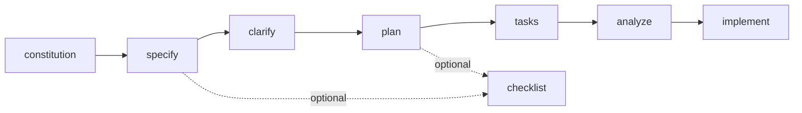

# Spec Kitクイックスタートガイド

## このドキュメントの目的

このドキュメントは、GitHub Spec Kitを初めて使う人向けの短縮版です。最短で次の2点を把握することを目的にしています。

- どの順番でコマンドを実行すればよいか
- 各コマンドに何を入力すればよいか

## 最初に覚える実行順



最小限の推奨フローは次の通りです。

```text
/speckit.constitution
/speckit.specify [機能説明]
/speckit.clarify
/speckit.plan [技術方針]
/speckit.tasks
/speckit.analyze
/speckit.implement
```

## まず理解しておくべき原則

- specify では What と Why を書く
- plan では How を書く
- clarify は plan の前に終える
- tasks の後に analyze を挟むと手戻りが減る
- checklist はコードのテストではなく、要件文書の品質チェック

## コマンド別の最短説明

### 1. /speckit.constitution

プロジェクトの原則を決めます。後続の仕様と計画の品質基準になります。

#### 何を書くか

- コード品質の原則
- テスト方針
- セキュリティや性能の方針

#### プロンプト例

```text
/speckit.constitution コード品質、テスト、自動化、アクセシビリティ、パフォーマンスを重視するプロジェクト原則を定義してください
```

### 2. /speckit.specify

作りたい機能の仕様を作ります。ここでは実装方法ではなく、作りたい価値と振る舞いを書きます。

#### 何を書くか

- 誰が使うか
- 何ができる必要があるか
- スコープ外は何か
- 成功条件は何か

#### 書かないこと

- 言語
- フレームワーク
- DB製品
- API形式

#### プロンプト例

```text
/speckit.specify Build a task management application for a small team. Users can create projects, add tasks, move tasks between columns, and leave comments. In this phase, login is out of scope.
```

### 3. /speckit.clarify

specify で作った仕様の曖昧さを減らします。通常は plan の前に実行します。

#### プロンプト例

```text
/speckit.clarify
/speckit.clarify Focus on security and performance requirements.
```

### 4. /speckit.checklist

要件文書の品質チェックリストを作ります。spec の後と plan の後に使えます。

#### プロンプト例

```text
/speckit.checklist
/speckit.checklist Focus on UX requirements quality
/speckit.checklist Create a checklist for the following domain: security
```

### 5. /speckit.plan

仕様をもとに技術計画を作ります。ここで初めて技術スタックや構成を書きます。

#### 何を書くか

- 言語やフレームワーク
- DBやストレージ
- APIスタイル
- テスト方針
- パフォーマンス制約

#### プロンプト例

```text
/speckit.plan Use FastAPI for backend services, PostgreSQL for storage, and React for the frontend. Prioritize simple deployment and a small number of dependencies.
```

### 6. /speckit.tasks

plan.md と spec.md から実装タスクを作ります。

#### プロンプト例

```text
/speckit.tasks
/speckit.tasks Please include test tasks using TDD approach.
/speckit.tasks We have 3 developers. Please maximize parallel task opportunities.
```

### 7. /speckit.analyze

spec.md、plan.md、tasks.md の整合性を確認します。実装前の最終点検です。

#### プロンプト例

```text
/speckit.analyze
/speckit.analyze Focus on security and performance requirements.
```

### 8. /speckit.implement

tasks.md に従って実装を進めます。

#### プロンプト例

```text
/speckit.implement
/speckit.implement MVP mode: Only implement User Story 1.
/speckit.implement Run all [P] tasks in Phase 2 in parallel before proceeding.
```

## 初心者向けの進め方

### パターン1: まず一通り回したい

```text
/speckit.constitution
/speckit.specify [機能説明]
/speckit.clarify
/speckit.plan [技術方針]
/speckit.tasks
/speckit.analyze
/speckit.implement
```

### パターン2: 品質も少し気にしたい

```text
/speckit.constitution
/speckit.specify [機能説明]
/speckit.clarify
/speckit.checklist
/speckit.plan [技術方針]
/speckit.checklist Create a checklist for the following domain: security
/speckit.tasks
/speckit.analyze
/speckit.implement
```

## よくある間違い

- specify に技術スタックを書いてしまう
- clarify を飛ばしたまま plan に進む
- plan なしで tasks を実行する
- tasks の直後に analyze を飛ばして implement に進む
- checklist を実装テストだと誤解する

## 次に読むべきもの

各コマンドの入出力、成果物の受け渡し、レビュー観点まで見たい場合は、[spec-kit_command_reference.md](spec-kit_command_reference.md) を参照してください。