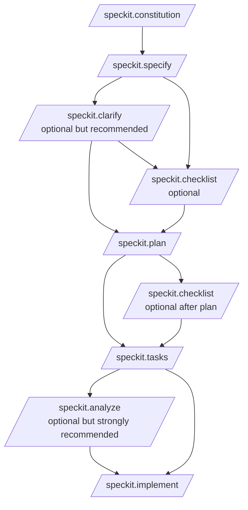

このページは、GitHub Spec Kit のガイドの入口です。用途に応じて、次のドキュメントを使い分けてください。

- 初めて使う人向けの短縮版: [Spec Kitクイックスタートガイド](/speckit-guide/guides/quickstart/)
- 実行順、入出力、前後関係まで確認したい人向けの詳細版: [Spec Kitコマンド詳細リファレンス](/speckit-guide/reference/command-reference-overview/)
- 仕様書(SoT)と Spec Kit の仕様同期・成熟度を整理したガイド: [仕様書(SoT)と Spec Kit の仕様同期・成熟度ガイド](/speckit-guide/operations/docs-sync/)
- `specs/**` の履歴資産としての扱いを整理したガイド: [`specs/**` 履歴資産運用ガイド](/speckit-guide/operations/)
- 実装やコマンド仕様の調査結果をまとめたノート: [Spec Kit調査ノート](/speckit-guide/research/)

## 最短で把握したい全体像



## まず覚えるべき実行順

```text
/speckit.constitution
/speckit.specify
/speckit.clarify
/speckit.plan
/speckit.tasks
/speckit.analyze
/speckit.implement
```

checklist は、spec 完成後か plan 完成後に挟む品質確認コマンドです。

## コマンドの役割を一言で言うと

- constitution: プロジェクト原則を決める
- specify: 何を作るかを定義する
- clarify: 仕様の曖昧さを減らす
- checklist: 要件の品質を点検する
- plan: どう作るかを技術計画に落とす
- tasks: 実装タスクへ分解する
- analyze: 仕様、計画、タスクの矛盾を検査する
- implement: 実装を進める

## 引数の早見表

| コマンド | 引数の要否 | 代表的な引数例 |
| --- | --- | --- |
| `/speckit.constitution` | 任意 | `テストファースト、API互換性維持、監査ログ、レスポンス性能、UI一貫性を必須原則として定義してください` |
| `/speckit.specify` | 必須 | `Build an application that helps a small team manage projects, tasks, and comments...` |
| `/speckit.clarify` | 任意 | `Focus on security and performance requirements.` |
| `/speckit.checklist` | 任意 | `Create a checklist for the following domain: security` |
| `/speckit.plan` | 任意 | `Use FastAPI for backend services, PostgreSQL for storage, and React for the frontend...` |
| `/speckit.tasks` | 任意 | `We have 3 developers. Please maximize parallel task opportunities.` |
| `/speckit.analyze` | 任意 | `Check if all non-functional requirements have corresponding tasks.` |
| `/speckit.implement` | 任意 | `MVP mode: Only implement User Story 1. Stop after validation.` |

## どちらを読むべきか

### 短縮版を読むべき人

- Spec Kitを初めて触る
- とりあえず実行順と最低限の使い方を知りたい
- 典型的なプロンプト例だけ先に見たい

### 詳細版を読むべき人

- コマンドごとの入力、出力、前提条件を確認したい
- どの成果物が次のコマンドに渡るのか整理したい
- チーム運用やレビュー観点まで押さえたい
