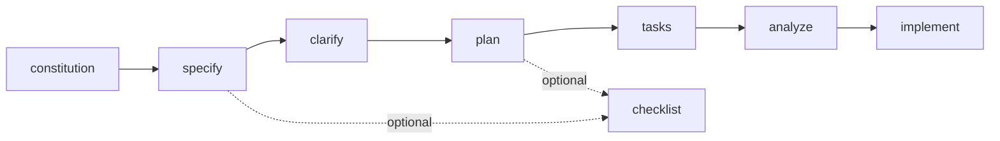

## このドキュメントの目的

このドキュメントは、GitHub Spec Kitを初めて使う人向けの短縮版です。最短で次の2点を把握することを目的にしています。

- どの順番でコマンドを実行すればよいか
- 各コマンドに何を入力すればよいか

## 最初に覚える実行順



最小限の推奨フローは次の通りです。

```text
/speckit.constitution
/speckit.specify [機能説明]
/speckit.clarify
/speckit.plan [技術方針]
/speckit.tasks
/speckit.analyze
/speckit.implement
```

## 引数の基本ルール

- `/speckit.specify` だけは機能説明の引数が必須です。
- それ以外のコマンドは引数なしでも実行できます。
- 引数は `--flag` ではなく、コマンドの後ろに自然言語で足す追加指示だと考えると分かりやすいです。
- `clarify` / `checklist` / `analyze` は任意ですが、`clarify` は推奨、`analyze` は強く推奨です。引数を渡すと確認観点を絞れます。

## まず理解しておくべき原則

- specify では What と Why を書く
- plan では How を書く
- clarify は plan の前に終える
- tasks の後に analyze を挟むと手戻りが減る
- checklist はコードのテストではなく、要件文書の品質チェック

## コマンド別の最短説明

### 1. /speckit.constitution

プロジェクトの原則を決めます。後続の仕様と計画の品質基準になります。

#### 引数の扱い

任意です。引数なしでも実行できますが、重視したい原則を自然言語で明示すると結果が安定します。

#### 何を書くか

- コード品質の原則
- テスト方針
- セキュリティや性能の方針

#### プロンプト例

```text
/speckit.constitution
/speckit.constitution コード品質、テスト、自動化、アクセシビリティ、パフォーマンスを重視するプロジェクト原則を定義してください
/speckit.constitution テストファースト、API互換性維持、監査ログ、レスポンス性能、UI一貫性を必須原則として定義してください
/speckit.constitution Library-First、CLI互換、TDD必須、観測性、SemVer遵守を非交渉原則として追加してください
```

### 2. /speckit.specify

作りたい機能の仕様を作ります。ここでは実装方法ではなく、作りたい価値と振る舞いを書きます。

#### 引数の扱い

必須です。誰が使うか、何ができる必要があるか、何をスコープ外にするか、成功条件は何かを自然言語で書きます。

#### 何を書くか

- 誰が使うか
- 何ができる必要があるか
- スコープ外は何か
- 成功条件は何か

#### 書かないこと

- 言語
- フレームワーク
- DB製品
- API形式

#### プロンプト例

```text
/speckit.specify Build a task management application for a small team. Users can create projects, add tasks, move tasks between columns, and leave comments. In this phase, login is out of scope.
/speckit.specify Develop a photo organization application. Users can create albums grouped by date, reorder albums by drag and drop, and preview photos in a tile layout. Nested albums are out of scope.
/speckit.specify Create a customer support dashboard where agents can claim tickets, add internal notes, change ticket status, and escalate unresolved issues. Phone integration is out of scope.
/speckit.specify Build an internal approval workflow for expense requests. Employees can submit requests, managers can approve or reject them, and finance can export approved items. Reimbursement payment itself is out of scope.
```

### 3. /speckit.clarify

specify で作った仕様の曖昧さを減らします。通常は plan の前に実行する推奨ステップです。

#### 引数の扱い

任意です。引数なしなら spec 全体の曖昧さを自動スキャンし、引数を渡すと確認したい論点を絞れます。

#### プロンプト例

```text
/speckit.clarify
/speckit.clarify Focus on security and performance requirements.
/speckit.clarify I want to clarify task card details, comment behavior, and project switching flow.
/speckit.clarify Clarify data retention, audit logging, and failure notification behavior.
```

### 4. /speckit.checklist

spec.md や plan.md の品質を確認するためのチェックリストを作ります。spec の後と plan の後に使えます。

#### 引数の扱い

任意です。引数なしなら汎用的なチェックリストを作り、引数を渡すと UX / security / API など対象ドメインを絞れます。

#### プロンプト例

```text
/speckit.checklist
/speckit.checklist Focus on UX requirements quality
/speckit.checklist Create a checklist for the following domain: security
/speckit.checklist Security checklist. Must include authentication requirements, data protection, and breach response requirements.
/speckit.checklist API contracts completeness and consistency
```

### 5. /speckit.plan

仕様をもとに技術計画を作ります。ここで初めて技術スタックや構成を書きます。

#### 引数の扱い

任意です。引数なしでも実行できますが、技術スタック、制約、アーキテクチャ方針を自然言語で与えると計画が安定します。

#### 何を書くか

- 言語やフレームワーク
- DBやストレージ
- APIスタイル
- テスト方針
- パフォーマンス制約

#### プロンプト例

```text
/speckit.plan Use FastAPI for backend services, PostgreSQL for storage, and React for the frontend. Prioritize simple deployment and a small number of dependencies.
/speckit.plan The application uses Vite with minimal libraries. Use vanilla HTML, CSS, and JavaScript as much as possible. Metadata is stored in a local SQLite database.
/speckit.plan We are going to generate this using .NET Aspire, Postgres as the database, and Blazor Server for the frontend. Provide REST APIs for projects, tasks, and notifications.
/speckit.plan Use Next.js for the web app, Supabase for authentication and storage, and background jobs for asynchronous notifications. Optimize for low operational overhead.
```

### 6. /speckit.tasks

plan.md と spec.md から実装タスクを作ります。

#### 引数の扱い

任意です。引数なしなら標準的な tasks を作り、引数を渡すと TDD、MVP 範囲、並列化方針などを指定できます。

#### プロンプト例

```text
/speckit.tasks
/speckit.tasks Please include test tasks using TDD approach.
/speckit.tasks We have 3 developers. Please maximize parallel task opportunities.
/speckit.tasks Focus on User Story 1 only for the MVP. Skip User Stories 2 and 3 for now.
/speckit.tasks Generate tasks that keep the API contract work separate from the UI work.
```

### 7. /speckit.analyze

spec.md、plan.md、tasks.md の整合性を確認します。実装前の最終点検であり、通常は tasks の後に挟むことを強く推奨します。

#### 引数の扱い

任意です。引数なしなら全体監査、引数ありなら security / performance / terminology / coverage など重点観点を指定できます。

#### プロンプト例

```text
/speckit.analyze
/speckit.analyze Focus on security and performance requirements.
/speckit.analyze Check if all non-functional requirements have corresponding tasks.
/speckit.analyze Review terminology drift between spec, plan, and tasks.
```

### 8. /speckit.implement

tasks.md に従って実装を進めます。

#### 引数の扱い

任意です。引数なしなら tasks 全体を進め、引数を渡すと実装範囲、停止条件、`[P]` タスクの扱いを絞れます。

#### プロンプト例

```text
/speckit.implement
/speckit.implement MVP mode: Only implement User Story 1.
/speckit.implement Run all [P] tasks in Phase 2 in parallel before proceeding.
/speckit.implement Only execute Phase 1 tasks and stop.
/speckit.implement Implement only the API and test tasks first. Leave the frontend tasks unchecked.
```

## 初心者向けの進め方

### パターン1: まず一通り回したい

```text
/speckit.constitution
/speckit.specify [機能説明]
/speckit.clarify
/speckit.plan [技術方針]
/speckit.tasks
/speckit.analyze
/speckit.implement
```

### パターン2: 品質も少し気にしたい

```text
/speckit.constitution
/speckit.specify [機能説明]
/speckit.clarify
/speckit.checklist
/speckit.plan [技術方針]
/speckit.checklist Create a checklist for the following domain: security
/speckit.tasks
/speckit.analyze
/speckit.implement
```

## よくある間違い

- specify に技術スタックを書いてしまう
- clarify を飛ばしたまま plan に進む
- plan なしで tasks を実行する
- tasks の直後に analyze を飛ばして implement に進む
- checklist を実装テストだと誤解する

## 次に読むべきもの

各コマンドの入出力、成果物の受け渡し、レビュー観点まで見たい場合は、[Spec Kitコマンド詳細リファレンス](/speckit-guide/reference/command-reference-overview/) を参照してください。
