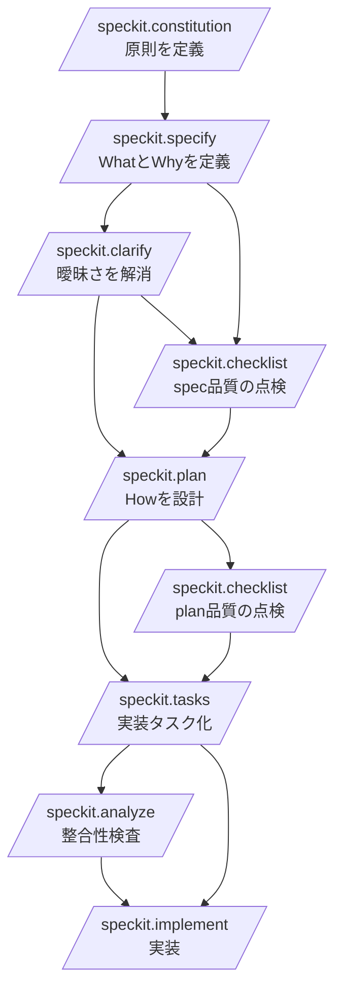
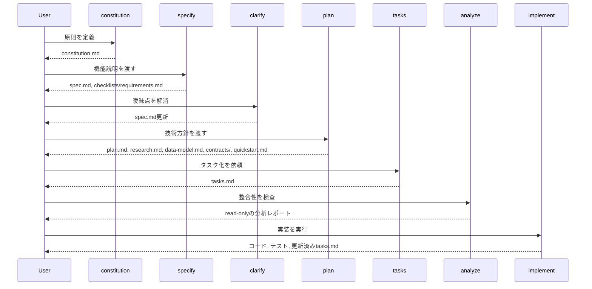

## このドキュメントの目的

このドキュメントは、GitHub Spec Kitの基本的な使い方を詳細に体系化したものです。特に以下を整理します。

- Spec Kitの基本フローと推奨されるコマンド実行順
- 各コマンドの目的、入力、出力、前後のコマンドとの関係
- 実行時の注意点と、次に進む判断基準
- 実際に使えるプロンプト例

本ドキュメントは、調査済みの以下のコマンドを対象にしています。

- /speckit.constitution
- /speckit.specify
- /speckit.clarify
- /speckit.checklist
- /speckit.plan
- /speckit.tasks
- /speckit.analyze
- /speckit.implement

## 全体像

Spec Kitは、仕様駆動開発を段階的に進めるためのコマンド群です。基本思想は、いきなり実装に入らず、まず仕様を固め、次に技術計画を作り、最後にタスク化してから実装することです。



推奨フローは次のとおりです。

```text
/speckit.constitution
  -> /speckit.specify
  -> /speckit.clarify          (任意、ただし推奨)
  -> /speckit.checklist        (任意、品質確認)
  -> /speckit.plan
  -> /speckit.checklist        (任意、plan後の品質確認)
  -> /speckit.tasks
  -> /speckit.analyze          (任意、ただし強く推奨)
  -> /speckit.implement
```

### コマンドの役割分担

- constitution: プロジェクト原則を定義する
- specify: 何を作るか、なぜ作るかを仕様として定義する
- clarify: 仕様の曖昧さを減らす
- checklist: 要件文書の品質を検証する
- plan: どう作るかを技術計画として定義する
- tasks: 実装タスクに分解する
- analyze: 仕様、計画、タスクの整合性を検査する
- implement: タスクに沿って実装を進める

### 引数の早見表

| コマンド | 引数の要否 | 代表的な引数例 |
| --- | --- | --- |
| `/speckit.constitution` | 任意 | `テストファースト、API互換性維持、監査ログ、レスポンス性能、UI一貫性を必須原則として定義してください` |
| `/speckit.specify` | 必須 | `Build an application that helps a small team manage projects, tasks, and comments...` |
| `/speckit.clarify` | 任意 | `Focus on security and performance requirements.` |
| `/speckit.checklist` | 任意 | `Create a checklist for the following domain: security` |
| `/speckit.plan` | 任意 | `Use FastAPI for backend services, PostgreSQL for storage, and React for the frontend...` |
| `/speckit.tasks` | 任意 | `We have 3 developers. Please maximize parallel task opportunities.` |
| `/speckit.analyze` | 任意 | `Check if all non-functional requirements have corresponding tasks.` |
| `/speckit.implement` | 任意 | `MVP mode: Only implement User Story 1. Stop after validation.` |

## 標準的な実行順

### 1. /speckit.constitution

最初に実行して、プロジェクトの原則を決めます。コード品質、テスト方針、UX一貫性、パフォーマンス要件、セキュリティ方針などをここで定義します。

constitution は後続のコマンド、とくに /speckit.specify と /speckit.plan の判断基準になります。先に定義しておくと、生成される成果物の一貫性が上がります。

### 2. /speckit.specify

次に、自然言語でフィーチャー説明を与えて仕様書を作ります。ここでは What と Why を扱い、How は扱いません。

この段階では、技術スタックやフレームワーク名を書かないのが原則です。

### 3. /speckit.clarify

specify の直後、plan の前に実行します。仕様に曖昧さ、未解決事項、抜けがある場合に、その場で対話しながら spec.md を更新します。

省略は可能ですが、探索的スパイクでない限り実行したほうがよい位置づけです。

### 4. /speckit.checklist

spec.md や plan.md の品質を確認するためのチェックリストを生成します。これはコードのテストではなく、要件記述の品質テストです。

タイミングは主に2回あります。

- spec 完成後、plan 前
- plan 完成後、tasks 前

### 5. /speckit.plan

仕様を入力にして、技術計画を作ります。ここで初めて技術スタック、アーキテクチャ、データモデル、APIコントラクト、検証手順などの How を扱います。

### 6. /speckit.tasks

plan.md と spec.md をもとに、実装のための tasks.md を生成します。タスクはフェーズ分けされ、依存関係や並列実行可能性もここで整理されます。

### 7. /speckit.analyze

tasks 完了後、implement の前に実行します。spec.md、plan.md、tasks.md を横断して、整合性、カバレッジ、曖昧さ、constitution 違反などを検査します。

任意コマンドですが、実装前の最終品質ゲートとして使うのが推奨です。

### 8. /speckit.implement

最後に、tasks.md を実行計画として実装を進めます。テスト、コード、進捗更新、検証まで含めた実装フェーズです。

## ワークフロー全体図



## ページ構成

長い詳細リファレンスを、目的ごとに次のページへ分割しました。

- [コマンド出力の読み方と成果物ガイド](/speckit-guide/reference/command-reference-reading-guide/)
- [仕様決定フェーズ: constitution, specify, clarify](/speckit-guide/reference/command-reference-constitution-specify-clarify/)
- [品質ゲート: checklist](/speckit-guide/reference/command-reference-checklist/)
- [実装準備フェーズ: plan, tasks, analyze](/speckit-guide/reference/command-reference-plan-tasks-analyze/)
- [実装フェーズと使い分けガイド](/speckit-guide/reference/command-reference-implement/)
