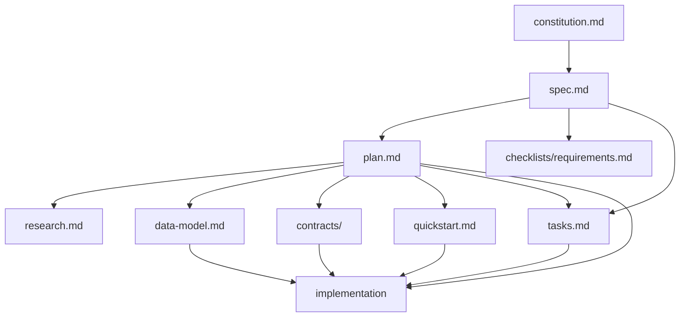

## /speckit.plan

### 目的

spec.md を受けて、技術的な実装計画を作成します。How を扱うフェーズです。

### 基本構文

```text
/speckit.plan [技術スタック・アーキテクチャ上の指示]
```

### 実際のプロンプト例

```text
/speckit.plan Use FastAPI for backend services, PostgreSQL for storage, and React for the frontend. Prioritize simple deployment and a small number of dependencies.
```

```text
/speckit.plan The application uses Vite with minimal libraries. Use vanilla HTML, CSS, and JavaScript as much as possible. Metadata is stored in a local SQLite database.
```

```text
/speckit.plan WebSocket for real-time messaging, PostgreSQL for history, Redis for presence.
```

### この段階で書くこと

- 言語、フレームワーク、主要ライブラリ
- データストレージ
- システム構成
- APIスタイル
- テスト方針
- パフォーマンス目標や制約

### 主な処理

- spec.md と constitution.md を読み込む
- Technical Context を埋める
- Constitution Check を行う
- research.md を作る
- data-model.md を作る
- contracts/ を作る
- quickstart.md を作る
- Phase 1 設計後に再度 constitution 整合を確認する

### 生成されるもの

```text
specs/[###-feature-name]/
  plan.md
  research.md
  data-model.md
  quickstart.md
  contracts/
```

### 前後のコマンドとの関係

- 前: /speckit.specify、必要に応じて /speckit.clarify
- 後: /speckit.tasks、必要に応じて /speckit.checklist

### 次に進む判断基準

- Constitution Check が通っている
- NEEDS CLARIFICATION が残っていない
- Project Structure のテンプレート残骸が消えている
- research、data model、contracts、quickstart の間に矛盾がない

### 実務上のポイント

- spec.md の繰り返しではなく、技術意思決定を書く
- 先回りの投機的な設計を増やしすぎない
- エラーケースや制約も plan に含める

## /speckit.tasks

### 目的

plan.md と spec.md を、実装可能なタスク一覧に分解します。AIや開発者がそのまま実装できる粒度の tasks.md を作るフェーズです。

### 基本構文

```text
/speckit.tasks
/speckit.tasks Please include test tasks using TDD approach.
/speckit.tasks We have 3 developers. Please maximize parallel task opportunities.
```

### 実際のプロンプト例

```text
/speckit.tasks
```

```text
/speckit.tasks Please include test tasks using TDD approach. Write tests first before implementation.
```

```text
/speckit.tasks Focus on User Story 1 only for the MVP. Skip User Stories 2 and 3 for now.
```

```text
/speckit.tasks We have 3 developers. Please maximize parallel task opportunities.
```

### 入力として重視されるもの

- spec.md
- plan.md
- data-model.md
- contracts/
- quickstart.md
- research.md

### 主な処理

- Setup フェーズを作る
- Foundational フェーズを作る
- User Storyごとのフェーズを P1、P2、P3 順で作る
- Polish フェーズを作る
- 依存関係を整理する
- 並列実行可能なタスクに [P] を付ける

### 生成されるもの

- tasks.md

### tasks.md の典型構造

```text
Phase 1: Setup
Phase 2: Foundational
Phase 3: User Story 1 (P1)
Phase 4: User Story 2 (P2)
Phase 5: User Story 3 (P3)
Phase N: Polish & Cross-Cutting Concerns
Dependencies & Execution Order
Parallel Opportunities
Implementation Strategy
```

### 前後のコマンドとの関係

- 前: /speckit.plan
- 後: /speckit.analyze または /speckit.implement

### 次に進む判断基準

- plan.md と spec.md の内容が全タスクに反映されている
- Phase 2 の共通基盤が十分に定義されている
- ファイルパスが具体的である
- [P] の付け方が妥当である
- ユーザーストーリーごとの独立テスト基準が書かれている

### 実務上のポイント

- サンプルタスクやプレースホルダーを残さない
- 曖昧な作業名ではなく、ファイル単位まで具体化する
- TDDをしたい場合は引数で明示する

## /speckit.analyze

### 目的

spec.md、plan.md、tasks.md の3つを横断的に読み、矛盾、曖昧さ、重複、カバレッジ不足、constitution 違反を検出します。

### 基本構文

```text
/speckit.analyze
/speckit.analyze Focus on security and performance requirements.
```

### 実際のプロンプト例

```text
/speckit.analyze
```

```text
/speckit.analyze Focus on security and performance requirements.
```

```text
/speckit.analyze Check if all non-functional requirements have corresponding tasks.
```

### 特徴

- 完全に read-only
- ファイルを自動修正しない
- 実装前の最終チェックとして使う

### 主な検出カテゴリ

- duplication
- ambiguity
- underspecification
- constitution alignment
- coverage gaps
- inconsistency

### 深刻度

- CRITICAL
- HIGH
- MEDIUM
- LOW

### 前後のコマンドとの関係

- 前: /speckit.tasks 完了後
- 後: 問題修正、または /speckit.implement

### 実行タイミング

- 最も早く実行できるのは tasks.md 作成直後
- 最も遅くて implement の直前

### 次に進む判断基準

- CRITICAL 問題がない
- HIGH 問題について対応方針がある
- タスクが全要件をカバーしている

### 実務上のポイント

- 任意だが、実質的には実装前の品質ゲートとして使うべき
- 修正を提案してもらうことはできるが、自動適用はしない

## 主要成果物の関係



```text
constitution.md
  基準と原則

spec.md
  何を作るか

checklists/requirements.md
  spec.md の品質自己点検

plan.md
  どう作るか

research.md
  技術判断の根拠

data-model.md
  データ設計

contracts/
  APIやイベントの境界定義

quickstart.md
  検証手順

tasks.md
  実装の作業単位
```

関係は次のように整理できます。

- constitution.md はすべての判断基準になる
- spec.md は plan.md の入力になる
- plan.md は tasks.md の入力になる
- research.md、data-model.md、contracts/、quickstart.md は plan を補強する設計成果物であり、tasks と implement の補助入力でもある
- analyze は spec、plan、tasks の3者関係を点検する
- implement は上記成果物をまとめて実装に変換する
